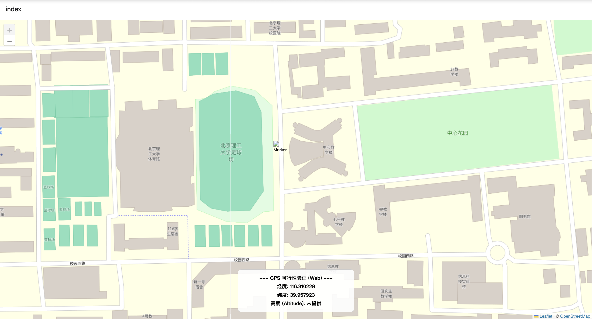

# 4D GIS标记系统 前端调研报告

## 项目框架

项目目标是构建一个支持Web端和原生移动端（iOS/Android）的跨平台应用，允许用户在2D地图上进行包含经度、纬度、高度和时间信息的四维标记。为了保证开发效率，技术栈选定为React Native (Expo框架)。

## GPS接口

系统需要在Web端和移动端获取用户当前的地理位置，包括经纬度和高度

由于系统运行在Expo框架下，所以移动端使用`expo-location`作为定位插件，网页端使用了原生的`geolocation.getCurrentPosition`接口。

测试结果如下：

web端能正常获取到用户经纬度，但是不能正常获取到高度，手机端可以正常获取到高度

### 解决方案

- 通过数据库查询当前经纬度大概高度（精度低）
- 暂时不记录高度，让用户自行填写高度（用户也未必知道）

## 地图接口调研

### 方案对比

1. react-native-maps

- **优点**: 功能丰富，社区庞大，是React Native生态中最常用的地图库。

- **缺点**:

	- **原生依赖**: Android端依赖Google Maps SDK，iOS端依赖Apple MapKit。Android端需要配置Google API Key，可能涉及费用和使用限制，且在中国大陆使用可能存在问题。

- **结论**: 因其对Google服务的强依赖，**不作为首选**。

2. @rnmapbox/maps (MapLibre GL Native)

- 需要mapbox授权，我没有国外信用卡，不给我用

3. 百度地图，高德地图等API

- 需要付费服务，不考虑

3. @maplibre/maplibre-react-native 

- **完全开源**: Mapbox GL Native SDK的社区分支，无商业许可限制。
- **独立渲染**: 使用自有的跨平台渲染引擎，不依赖Google/Apple原生SDK。
- **高性能**: 基于GPU加速，尤其擅长矢量瓦片渲染，交互流畅。
- **强大的OSM支持**: 与Mapbox样式规范兼容，可加载各类OSM瓦片源（栅格、矢量）。

5. react-leaflet (Web 端)

- **优点**: 基于流行的Leaflet.js库，是Web端地图开发的标准选择，对OSM支持良好，文档丰富。
- **缺点**: 仅适用于Web浏览器环境。
- **结论**: 在采用平台特定文件（`.native.tsx`, `.web.tsx`）策略后，**确定为Web端的地图库**。

## OSM瓦片源访问

直接访问OSM官方瓦片服务器 (`https://{a,b,c}.tile.openstreetmap.org`) 存在DNS污染在中国大陆地区访问困难。

解决方案：Cloudflare反向代理 (Worker):

- **优点**: 利用Cloudflare全球CDN加速和缓存，无需维护自己的代理服务器，免费额度充足，可通过Worker脚本修改请求头（Host, User-Agent）解决`421`错误和满足OSM策略，易于添加访问控制。
- **缺点**: 依赖Cloudflare服务，需要配置Worker脚本。

- **结论**: **Cloudflare Worker方案**是当前最优解，兼顾了性能、成本和可维护性。

